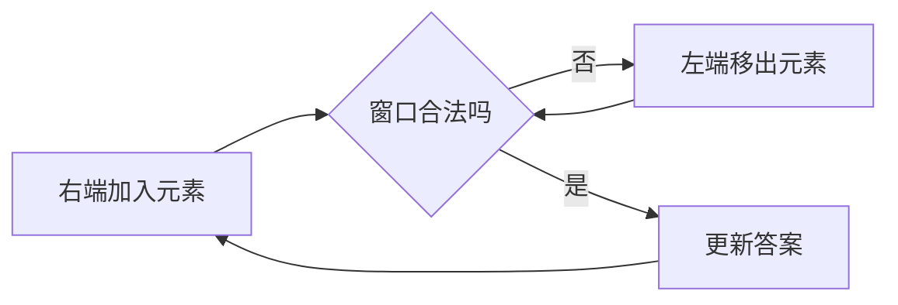

# 双指针与滑动窗口

## 核心思想

双指针不是“放两个变量”，而是利用单调性避免重复扫描。必须先说清：每个指针代表什么，以及移动后仍保持什么不变量。

## 同向双指针：读写分离

`read` 负责探索，`write` 维护答案区间。删除元素时，不变量是 `[0, write)` 始终只包含应保留的元素。

```cpp
int write = 0;
for (int value : nums) {
  if (should_keep(value)) nums[write++] = value;
}
```

已验证示例：[27_remove_element.cpp](../string_and_array/27_remove_element.cpp#L13-L39)。

## 相向双指针：有序数组夹逼

三数之和先排序、固定第一个数，再让左右指针逼近目标：[3sum.cpp](../string_and_array/3sum.cpp#L25-L66)。

```text
[-4, -1, -1, 0, 1, 2]
      fixed  L        R

sum 太小 -> L 右移
sum 太大 -> R 左移
sum 命中 -> 记录并跳过重复值
```

不变量：被左右边界排除的组合不可能再构成答案。排序的价值不仅是夹逼，也让去重变成“跳过相邻相同值”。

## 滑动窗口

适用信号：连续子数组/子串、最长或最短、窗口条件可随右端点扩张并通过左端点收缩恢复。

```cpp
for (int right = 0; right < n; ++right) {
  add(nums[right]);
  while (!valid()) remove(nums[left++]);
  update_answer(left, right);
}
```



## 快慢指针

链表判环中，慢指针一次一步、快指针一次两步；若有环，快指针会像操场跑圈的人一样从后方追上慢指针。数组原地去重也可视为快慢指针。

## 易错点与训练

- 窗口是 `[left, right]` 还是 `[left, right)` 必须统一。
- “最长合法窗口”通常非法时收缩；“最短满足窗口”通常合法时继续收缩。
- 去重应在排序后完成，并分别处理固定指针、左指针和右指针。
- 练习顺序：移除元素 → 两数之和 II → 三数之和 → 最长无重复子串 → 最小覆盖子串。
