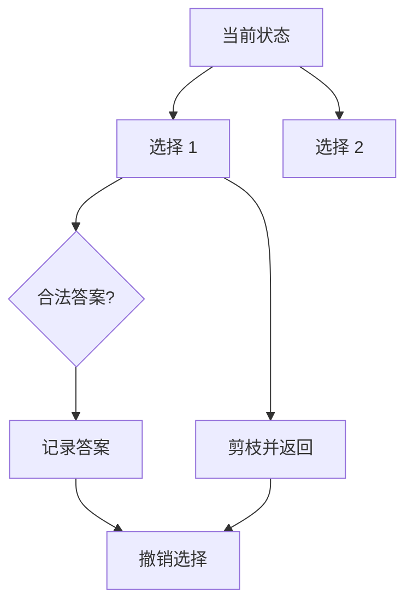

# 树、Trie 与搜索

## 树递归：先定义函数语义

树题先回答：“这个函数对一棵以 `root` 为根的树返回什么？”递归不是从代码细节开始，而是相信左右子树能返回约定结果，再组合它们。

```cpp
Result solve(TreeNode* root) {
  if (root == nullptr) return base;
  Result left = solve(root->left);
  Result right = solve(root->right);
  return combine(root, left, right);
}
```

例如验证 BST 时，递归参数携带当前节点允许的开区间 `(lower, upper)`：[binary_tree.cpp](../tree/binary_tree.cpp#L46-L62)。该文件有未提交改动且包含重复 `Solution`，本轮只引用、不迁移。

## DFS、BFS 与回溯

- DFS：沿一条路走到底，适合路径、连通性、组合枚举。
- BFS：按层扩散，适合无权最短步数、层序遍历。
- 回溯：DFS + 选择列表 + 撤销选择，适合排列组合和分割。

```cpp
void backtrack(State& state) {
  if (is_answer(state)) {
    answers.push_back(state);
    return;
  }
  for (Choice choice : choices(state)) {
    apply(state, choice);
    backtrack(state);
    undo(state, choice);
  }
}
```



恢复 IP 地址展示了“层数、起点、合法性剪枝”三件事：[bm74_restore_ip_addresses.cpp](../DP/bm74_restore_ip_addresses.cpp#L13-L56)。

## Trie：用路径表示前缀

Trie 节点不保存完整单词；从根到节点的路径就是前缀，`is_word` 区分“只是前缀”和“完整单词”。仓库实现：[208_trie.cpp](../tree/208_trie.cpp#L29-L92)。

```text
root
 └─ c
    └─ a
       ├─ t*    cat
       └─ r*    car
```

插入、查询、前缀查询均为 `O(L)`，其中 `L` 是字符串长度；代价是节点分支带来的空间开销。

## 易错点与复习

- 递归终止条件与空节点语义不一致。
- 回溯忘记撤销，导致不同分支共享污染状态。
- 二维网格 DFS 忘记恢复访问标记或越界判断。
- Trie 查询前缀时错误要求 `is_word == true`。
- 练习顺序：遍历 → 最大深度 → 路径和 → 层序 → 构造树 → 排列组合 → 单词搜索。
