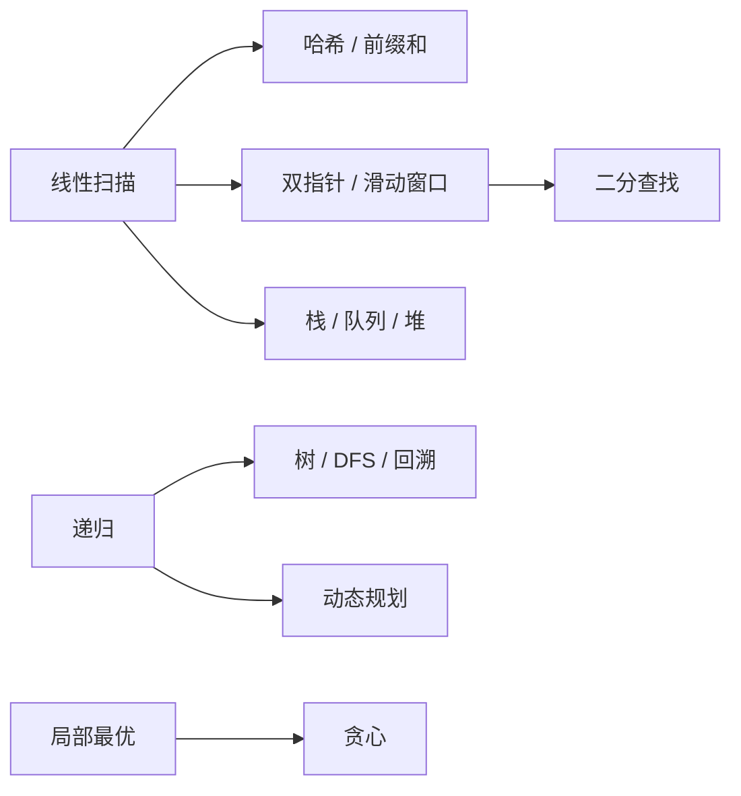

# LeetCode 复习笔记

这套笔记按“解题模型”组织，而不是按题号罗列。复习目标是看到题目后能快速识别模型、说出不变量，并在 10～15 分钟内写出模板。

## 学习地图

## 章节导航

1. [数组、字符串与哈希](01_array_string_hash.md)
2. [双指针与滑动窗口](02_two_pointers_window.md)
3. [栈、队列与堆](03_stack_queue_heap.md)
4. [链表](04_linked_list.md)
5. [树、Trie 与搜索](05_tree_trie_search.md)
6. [二分查找](06_binary_search.md)
7. [动态规划与贪心](07_dynamic_programming_greedy.md)
8. [位运算、数学与杂项](08_bit_math_misc.md)
9. [仓库审查与刷题工作流](09_repository_review_and_workflow.md)
10. [用 CMake 管理刷题代码](10_cmake_for_leetcode.md)

## 推荐复习顺序

先掌握数组/哈希和双指针，再学习栈队列、二分与链表；随后进入树与搜索，最后集中训练 DP 和贪心。每章按以下循环复习：

1. 不看代码说出适用信号和不变量。
2. 默写模板，并用一个最小例子手动跟踪。
3. 本地完成一道原题和一道变式题。
4. 将失败用例补进题目文件的 `main`。
5. 隔天、隔周各重写一次。

## 本仓库的规范示例

- 二分查找：[704_binary_search.cpp](../binary_search/704_binary_search.cpp#L15-L41)
- 双指针：[27_remove_element.cpp](../string_and_array/27_remove_element.cpp#L13-L39)
- 动态规划/状态压缩思维：[121_best_time_to_buy_and_sell_stock.cpp](../DP/121_best_time_to_buy_and_sell_stock.cpp#L14-L34)
- 回溯：[bm74_restore_ip_addresses.cpp](../DP/bm74_restore_ip_addresses.cpp#L13-L68)

> 历史代码中存在尚未迁移或未测试的实现。笔记只把通过本地构建和断言测试的文件标为“已验证”。
