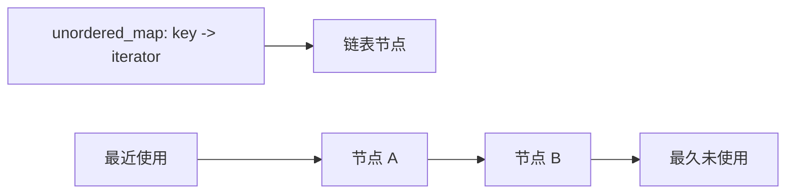

# 链表

## 核心思想

链表题的难点不是遍历，而是修改指针时不丢失“下一站”。动手前先写出每个指针的职责；修改 `current->next` 前，通常先保存 `next`。

## 虚拟头节点

当头节点可能被删除或替换时，引入 `dummy`，让所有节点都拥有统一的前驱。

```text
dummy -> 1 -> 2 -> 3
  pre    cur
```

```cpp
ListNode dummy(0, head);
ListNode* previous = &dummy;
```

仓库的“删除全部重复节点”实现展示了虚拟头节点思路：[83_remove_duplicates.cpp](../../algo/linked_list/83_remove_duplicates.cpp#L126-L145)。该历史文件包含多种实现，尚未纳入默认 CMake 构建。

## 反转链表模板

```cpp
ListNode* previous = nullptr;
while (head != nullptr) {
  ListNode* next = head->next;
  head->next = previous;
  previous = head;
  head = next;
}
return previous;
```

不变量：`previous` 指向已经反转完成的链表头，`head` 指向尚未处理的第一个节点。

## 快慢指针与双指针

- 判环：快指针每次两步，慢指针每次一步。
- 倒数第 K 个：快指针先走 K 步，再与慢指针同步移动。
- 相交链表：两个指针分别走 `A+B` 与 `B+A`，消除长度差。

## LRU：哈希表 + 双向链表

哈希表负责 `O(1)` 找节点，双向链表负责 `O(1)` 移动和淘汰。仓库实现使用 `list` 保存访问顺序，用 map 保存迭代器：[146_lru_cache.cpp](../../algo/linked_list/146_lru_cache.cpp#L18-L63)。



## 易错点

- 删除节点后继续访问已释放指针。
- 反转区间时忘记连接区间前后两端。
- 合并链表时未保存当前节点的 `next`。
- 使用裸 `new` 后没有明确所有权；面试代码可简化，但本地测试应释放辅助节点。
