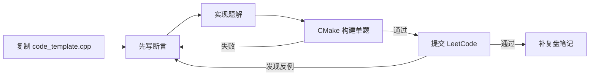

# 仓库审查与刷题工作流

## 审查结论

仓库已经按数组、链表、树、DP 等主题积累了大量实现，适合作为复习素材；主要问题不是分类方向，而是“源码、实验入口和历史汇总混在一起”。

扫描基线：实施前用 C++17 逐文件语法检查时，70 个通过、8 个失败。首批迁移后是 76 个通过、4 个失败；剩余失败文件为 `algo/tree/binary_tree.cpp`、`algo/LCR/lcr_solution.cc`、`algo/linked_list/linked_list.cpp` 和 `algo/leet_code_top100.cpp`。失败主要来自聚合文件中重复的 `Solution` 或同名函数。该数字是本地命令结果，不代表通过文件的算法一定正确。

可观察的结构问题：

- 多题聚合文件会发生重定义，例如树文件在多个位置声明 `Solution`：[binary_tree.cpp](../../algo/tree/binary_tree.cpp#L38-L46)、[binary_tree.cpp](../../algo/tree/binary_tree.cpp#L107-L116)。
- 历史文件普遍依赖聚合头文件 [head_file.h](../../algo/head_file.h#L1-L26)，复制到 LeetCode 时不够自包含。
- 旧模板带 Windows `system("pause")`；新的 [code_template.cpp](../../tools/templates/code_template.cpp#L1-L26) 已改为标准断言入口。
- 生成的二进制曾被提交到仓库；本轮将其从版本控制移除，并通过 `.gitignore` 忽略。

目录已统一整理到 `algo/`；题解内容仍按复习进度逐步拆分、补测试。

## 一题一文件规范

```text
algo/<category>/<id>_<snake_case_title>.cpp
```

每个文件包含：题目信息、核心思想、不变量、复杂度、一个 LeetCode 风格解答、普通 `main`。多种解法可留在同一题文件，但名称必须不同。

`main` 至少覆盖：

1. 官方示例。
2. 空输入或最小规模。
3. 最容易打破当前算法的反例。

## 日常流程



```bash
cp tools/templates/code_template.cpp algo/string_and_array/123_example.cpp
# 在 algo/CMakeLists.txt 注册 target
cmake -S . -B build -DCMAKE_BUILD_TYPE=Debug
cmake --build build --target lc_123_example
./build/bin/lc_123_example
```

提交 LeetCode 时，只复制解答类或函数。平台发现的失败用例必须回填到本地 `main`，否则本地测试集不会成长。

## 迁移清单

优先顺序：

1. 当前无法编译且题数较少的聚合文件。
2. 高频复习类别中的代表题。
3. `algo/leet_code_top100.cpp` 等大型历史归档。

目录整理保留 `algo/tree/binary_tree.cpp` 和 `algo/LCR/` 的原有源码内容。`algo/leet_code_top100.cpp`、`algo/linked_list/linked_list.cpp`、`algo/tree/binary_tree.cpp` 也不进入默认 CMake 构建。

## 代码风格建议

- 新文件只包含实际需要的标准头文件。
- 输入参数默认用 `const T&`；确实需要原地修改时才用 `T&`。
- 优先 `nullptr`，避免 `NULL`。
- 用 `left/right/read/write` 等角色名代替无语义缩写。
- 注释解释“不变量和为什么”，不逐句翻译代码。
- 时间复杂度包含排序成本，例如“排序 + 扫描”是 `O(n log n)`，不是 `O(log n)`。
